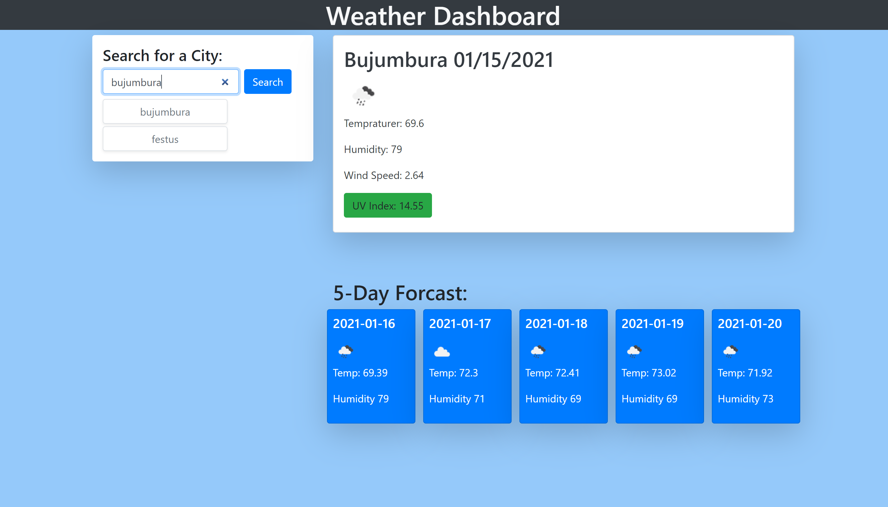

# Weather-Dashboard

## Project Description
This a project that gives the user the weather forecast for the city that they type into the input field. The application displays the current day forecast along with a five day forecast. The cities that the user selects are added beneath the input field, and the user can click on that city's box to retrieve that city's forecast. The last city the user submitted is saved in local storage. 

## Mock Up

## Deployment
https://ccsxw6.github.io/Weather-Dashboard/